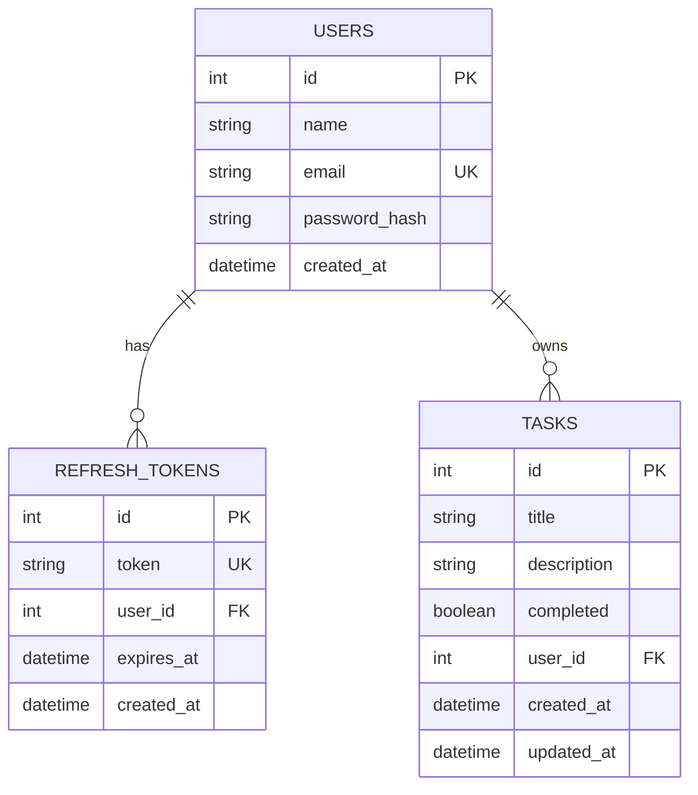

# Database schema — auth-postgres

Visual reference for teaching students.

---

## ER diagram (Entity Relationship)



**Legend:**
- **PK** = Primary Key (unique id for each row)
- **FK** = Foreign Key (links to another table)
- **UK** = Unique (no duplicates allowed)
- `||--o{` = one user has many tokens/tasks

---

## Tables explained

### 1. `users`

Stores registered accounts.

| Column | Type | Meaning |
|--------|------|---------|
| id | SERIAL | Auto-increment primary key |
| name | VARCHAR | Display name |
| email | VARCHAR UNIQUE | Login email (no duplicates) |
| password_hash | TEXT | bcrypt hash (never plain password) |
| created_at | TIMESTAMP | When account was created |

---

### 2. `refresh_tokens`

Long-lived tokens for getting new access tokens.

| Column | Type | Meaning |
|--------|------|---------|
| id | SERIAL | Primary key |
| token | TEXT UNIQUE | Random refresh token string |
| user_id | INT FK → users.id | Which user owns this token |
| expires_at | TIMESTAMP | When token becomes invalid |
| created_at | TIMESTAMP | When token was issued |

**On delete user:** all refresh tokens for that user are deleted (`ON DELETE CASCADE`).

---

### 3. `tasks`

Things a logged-in user can create and manage.

| Column | Type | Meaning |
|--------|------|---------|
| id | SERIAL | Primary key |
| title | VARCHAR | Task title (required) |
| description | TEXT | Optional details |
| completed | BOOLEAN | Done or not (default false) |
| user_id | INT FK → users.id | Owner of the task |
| created_at | TIMESTAMP | When task was created |
| updated_at | TIMESTAMP | Last update time |

**Teaching point:** User A cannot see or edit User B's tasks — enforced in `taskService.js`.

---

## Relationships

```
users (1) ──────< (many) refresh_tokens
users (1) ──────< (many) tasks
```

- One **user** can have **many** refresh tokens (login from phone + laptop)
- One **user** can have **many** tasks
- Each task belongs to **exactly one** user

---

## ASCII diagram (for whiteboard)

```
┌─────────────────┐       ┌──────────────────────┐
│     users       │       │   refresh_tokens     │
├─────────────────┤       ├──────────────────────┤
│ id (PK)         │───┐   │ id (PK)              │
│ name            │   └──<│ user_id (FK)         │
│ email (UNIQUE)  │       │ token (UNIQUE)       │
│ password_hash   │       │ expires_at           │
│ created_at      │       │ created_at           │
└────────┬────────┘       └──────────────────────┘
         │
         │ 1 : many
         ▼
┌─────────────────┐
│     tasks       │
├─────────────────┤
│ id (PK)         │
│ title           │
│ description     │
│ completed       │
│ user_id (FK)    │
│ created_at      │
│ updated_at      │
└─────────────────┘
```

---

## API → database flow (example: create task)

```
POST /api/tasks  +  Bearer accessToken
        ↓
requireAuth → req.user.userId = 1
        ↓
taskService.create(userId, { title: "Study Prisma" })
        ↓
prisma.task.create({ data: { title, userId: 1 } })
        ↓
INSERT INTO tasks (title, user_id, ...) VALUES (...)
        ↓
Row saved in PostgreSQL
```

---

## SQL to inspect data (pgAdmin Query Tool)

```sql
-- All users
SELECT id, name, email, created_at FROM users;

-- Tasks with owner name
SELECT t.id, t.title, t.completed, u.name AS owner
FROM tasks t
JOIN users u ON t.user_id = u.id;

-- Count tasks per user
SELECT u.email, COUNT(t.id) AS task_count
FROM users u
LEFT JOIN tasks t ON u.id = t.user_id
GROUP BY u.email;
```
